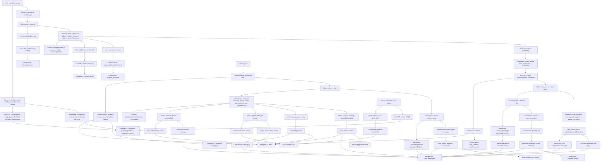

```mermaid
flowchart TD
    A["User opens homepage"] --> B["Frontend: load properties, feedback, wishlist, hero videos"]
    B --> C["Core API: /api/properties, /api/properties/feedback-summary, /api/banners"]
    C --> D["PostgreSQL: properties, property_feedback, campaign_banners"]

    A --> E["Visitor ID created in localStorage"]
    E --> F["User opens a property"]
    F --> G["Frontend tracks browsing"]
    G --> H["Core API: /api/browsing-history"]
    H --> I["PostgreSQL: browsing_history"]

    F --> J["Property detail page loads gallery, reviews, compare options, recent browsing"]
    J --> K["Core API: property detail + reviews + wishlist + browsing history"]

    J --> L["User adds/removes shortlist"]
    L --> M["Core API: wishlist endpoints"]
    M --> N["PostgreSQL: wishlist_items"]

    J --> O["User submits one review"]
    O --> P["Core API: POST /api/properties/:id/feedback"]
    P --> Q["PostgreSQL: property_feedback"]

    J --> R["User clicks 'Check Availability'"]
    R --> S["Lead modal: name, mobile, from, till, members, disclaimer"]
    S --> T["Core API: POST /api/leads/check-availability"]
    T --> U["Create or reuse lead"]
    U --> V["PostgreSQL: leads"]
    U --> W["Redis publish: lead_created / lead_resumed"]
    T --> X["Return lead_id + user chat token"]

    X --> Y["Frontend opens docked chat"]
    Y --> Z["WebSocket: /ws/chat/{lead_id}?role=user&token=..."]
    Z --> AA["Chat service fetches recorded history"]
    AA --> AB["PostgreSQL: chat_messages"]

    X --> AC["Frontend sends auto intro message with property + dates + members"]
    AC --> AD["Chat service: POST /api/chat/{lead_id}/auto-intro"]
    AD --> AE["Persist first user requirement message"]
    AE --> AB
    AD --> AF["3 sec delayed admin auto reply"]
    AF --> AB

    AG["Admin logs in"] --> AH["Frontend admin dashboard boot"]
    AH --> AI["Core API: leads, analytics, context, properties, hero videos"]
    AI --> D
    AI --> V
    AI --> AJ["PostgreSQL: payments, audit_logs"]

    AH --> AK["Admin selects a lead"]
    AK --> AL["Operations panel loads browsing history, wishlist, payment summary, recorded chat"]
    AL --> AM["Core API: /api/admin/leads/:id/context + /messages"]

    AK --> AN["Admin opens docked realtime chat"]
    AN --> AO["WebSocket: /ws/chat/{lead_id}?role=admin&token=..."]
    AO --> AB

    AN --> AP["Admin quick actions / typed messages"]
    AP --> AQ["Chat service persists + broadcasts"]
    AQ --> AB
    AQ --> AR["Redis publish: chat_events"]

    AL --> AS["Admin marks Available / Not Available"]
    AS --> AT["Core API inventory-check"]
    AT --> V
    AS --> AU["Chat service status message"]
    AU --> AB

    AL --> AV["Admin uploads GPay QR image"]
    AV --> AW["Chat service media upload"]
    AW --> AX["Local storage or S3"]
    AV --> AY["Admin shares GPay details"]
    AY --> AZ["Chat service share-gpay"]
    AZ --> AB

    Y --> BA["User uploads payment proof screenshot"]
    BA --> BB["Chat service upload-proof"]
    BB --> BC["payment_proofs row + chat message"]
    BC --> AB
    BC --> BD["PostgreSQL: payment_proofs"]

    AL --> BE["Admin saves payment entry"]
    BE --> BF["Core API payment"]
    BF --> AJ
    BF --> V

    AL --> BG["Admin confirms booking + optional WhatsApp"]
    BG --> BH["Chat service confirm"]
    BH --> V
    BH --> AB
    BH --> BI["WhatsApp provider hook"]

    BJ["Admin adds/edits hero videos"] --> BK["Upload video or paste direct URL"]
    BK --> BL["Chat service upload or stored URL"]
    BL --> AX
    BJ --> BM["Core API banner CRUD"]
    BM --> D

    B --> BN["Homepage hero playlist reads active direct video banners"]

```